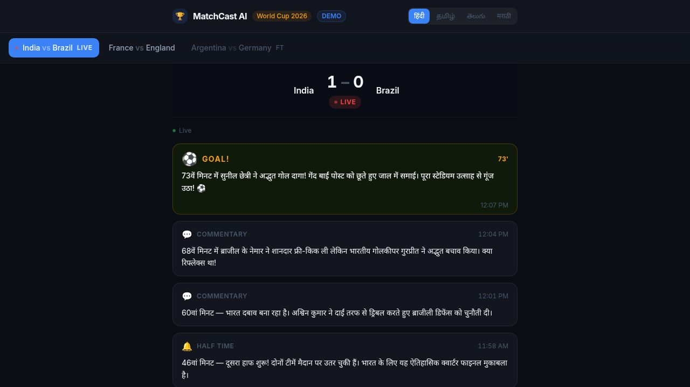

# MatchCast AI 🏆

> Real-time AI-powered football commentary in Indian regional languages — Hindi, Tamil, Telugu, and Marathi.

MatchCast AI delivers live match commentary through a web app, mobile app, and Telegram bot — all powered by AI and streamed in real-time using Supabase Realtime. Built for the 2026 FIFA World Cup.

---

## Screenshots

### Web App


---

## Features

- **Real-time Commentary** — Server-Sent Events (SSE) stream new commentary updates instantly as events happen
- **4 Indian Languages** — Hindi (हिंदी), Tamil (தமிழ்), Telugu (తెలుగు), Marathi (मराठी)
- **Live Match Tracking** — Visual live indicators with animated pulse; match scores updated in real-time
- **Event Tagging** — Goals ⚽, Yellow/Red Cards 🟨🟥, Substitutions 🔄, VAR Reviews 🖥️ — each styled distinctly
- **Multi-platform** — Web (React + Vite), Mobile (Expo React Native), Telegram Bot
- **Monetization Layer** — Sponsor injection into commentary feeds, Razorpay payment integration for premium tiers
- **API-first** — Clean REST + SSE API with OpenAPI spec; mobile app uses polling, web uses SSE

---

## Architecture

```
┌─────────────────────────────────────────────────────────────────┐
│                        Client Layer                             │
│   ┌──────────────────┐   ┌──────────────────┐   ┌───────────┐  │
│   │  Web (React+Vite)│   │  Mobile (Expo RN) │   │ Telegram  │  │
│   │  SSE streaming   │   │  REST polling 5s  │   │    Bot    │  │
│   └────────┬─────────┘   └────────┬──────────┘   └─────┬─────┘  │
└────────────┼────────────────────┬─┼──────────────────────┼───────┘
             │                   │ │                      │
             ▼                   ▼ ▼                      ▼
┌─────────────────────────────────────────────────────────────────┐
│                     Express API Server                          │
│  GET /api/matches          GET /api/commentary/:matchId         │
│  GET /api/stream/:matchId  (SSE + keepalive)                    │
└──────────────────────────────┬──────────────────────────────────┘
                               │ Supabase JS Client
                               ▼
┌─────────────────────────────────────────────────────────────────┐
│                         Supabase                                │
│  ┌──────────┐  ┌───────────────────┐  ┌──────────────────────┐  │
│  │ matches  │  │ commentary_updates│  │  users / payments    │  │
│  │  table   │  │  (multi-language) │  │  sponsors / api_keys │  │
│  └──────────┘  └───────────────────┘  └──────────────────────┘  │
│                     Postgres + Realtime                         │
└─────────────────────────────────────────────────────────────────┘
```

**Data flow for live commentary:**
1. An AI agent or ingestion pipeline inserts a row into `commentary_updates`
2. Supabase Realtime fires a Postgres CDC event
3. The API server (subscribed via Supabase JS) receives the event and pushes it over SSE
4. The web client receives it within milliseconds and renders the new card
5. The mobile client polls `/api/commentary/:matchId` every 5 seconds

---

## Tech Stack

| Layer | Technology |
|-------|------------|
| Frontend | React 19, Vite 7, Tailwind CSS v4, Wouter |
| Mobile | Expo SDK 54, React Native 0.81, Expo Router |
| Backend | Node.js 24, Express 5, TypeScript 5.9 |
| Database | Supabase (Postgres + Realtime) |
| Realtime | Server-Sent Events (SSE) + Supabase Realtime |
| Monorepo | pnpm workspaces |
| Build | esbuild (API), Vite (web), Expo (mobile) |

---

## Project Structure

```
matchcast/
├── artifacts/
│   ├── matchcast/           # React + Vite web frontend
│   │   ├── src/
│   │   │   ├── components/  # Scoreboard, CommentaryFeed, MatchSelector, etc.
│   │   │   ├── pages/       # HomePage, NotFound
│   │   │   └── index.css    # Tailwind v4 theme + animations
│   │   └── vite.config.ts
│   ├── api-server/          # Express 5 API server
│   │   └── src/routes/
│   │       ├── matches.ts   # /api/matches + /api/stream/:id + /api/commentary/:id
│   │       └── health.ts    # /api/healthz
│   └── matchcast-mobile/    # Expo React Native app
│       └── app/
│           ├── (tabs)/      # Main tab screens
│           └── _layout.tsx
├── lib/
│   ├── api-spec/            # OpenAPI specification
│   ├── api-client-react/    # Generated React Query hooks
│   ├── api-zod/             # Generated Zod schemas
│   └── db/                  # Drizzle ORM (Postgres)
└── supabase_migration.sql   # One-time schema setup
```

---

## Demo Mode

**No Supabase credentials? No problem.** The API server ships with a built-in demo mode that serves realistic World Cup 2026 fixture data whenever `SUPABASE_URL` / `SUPABASE_SERVICE_ROLE_KEY` are not set:

| Match | Status | Score |
|-------|--------|-------|
| 🇮🇳 India vs Brazil 🇧🇷 | 🔴 LIVE (73') | 1 – 0 |
| 🇫🇷 France vs England 🏴󠁧󠁢󠁥󠁮󠁧󠁿 | ⏳ Upcoming | – |
| 🇦🇷 Argentina vs Germany 🇩🇪 | ✅ FT | 2 – 1 |

- Full AI commentary in all 4 languages — Hindi, Tamil, Telugu, Marathi
- The SSE stream drip-feeds new commentary lines every 10 seconds, simulating a live match
- A `DEMO` badge appears in the header so you always know which mode is active
- Swap in Supabase credentials at any time to switch to real live data — zero code changes needed

---

## Getting Started

### Prerequisites

- Node.js 20+
- pnpm 10+
- Supabase is **optional** — the app works fully in Demo Mode without it

### 1. Clone and install

```bash
git clone https://github.com/<your-username>/matchcast-ai.git
cd matchcast-ai
pnpm install
```

### 2. Set up Supabase

1. Go to your Supabase project → **SQL Editor**
2. Paste and run the contents of `supabase_migration.sql`
3. This creates all required tables: `matches`, `commentary_updates`, `users`, `sponsors`, `payments`, `api_keys`

### 3. Configure secrets

Create a `.env` file at the workspace root (or set them in Replit Secrets):

```env
SUPABASE_URL=https://<your-ref>.supabase.co
SUPABASE_SERVICE_ROLE_KEY=<your-service-role-key>
```

> **Note:** The API server also accepts Supabase dashboard URLs (`https://supabase.com/dashboard/project/<ref>`) and auto-resolves them.

### 4. Run locally

```bash
# API server (port 8080)
pnpm --filter @workspace/api-server run dev

# Web frontend (port 22888)
pnpm --filter @workspace/matchcast run dev

# Mobile app
pnpm --filter @workspace/matchcast-mobile run dev
```

Or on Replit — workflows start automatically.

### 5. Seed match data

Insert a row into `matches` in Supabase:

```sql
INSERT INTO matches (fixture_id, home_team, away_team, home_score, away_score, status, kickoff_at)
VALUES (1001, 'India', 'Brazil', 1, 0, 'live', NOW());
```

Then insert commentary:

```sql
INSERT INTO commentary_updates (fixture_id, content, event_type, event_minute, language)
VALUES
  (1001, 'सुनील छेत्री ने शानदार गोल दागा!', 'goal', 23, 'hi'),
  (1001, 'சுனில் செட்ரி அற்புதமான கோல் அடித்தார்!', 'goal', 23, 'ta');
```

---

## API Reference

### `GET /api/matches`
Returns today's matches (status: `live`, `scheduled`, `finished`).

```json
[
  {
    "id": "uuid",
    "fixture_id": 1001,
    "home_team": "India",
    "away_team": "Brazil",
    "home_score": 1,
    "away_score": 0,
    "status": "live",
    "kickoff_at": "2026-06-14T18:00:00Z"
  }
]
```

### `GET /api/stream/:matchId?lang=hi`
SSE endpoint. Streams commentary events in real-time:

```
data: {"type":"commentary","update":{"id":"...","text":"...","eventType":"goal","minute":23,"language":"hi","timestamp":"..."}}
```

Supported `lang` values: `hi` (Hindi), `ta` (Tamil), `te` (Telugu), `mr` (Marathi)

### `GET /api/commentary/:matchId?lang=hi&limit=30`
REST polling endpoint. Returns the last N commentary updates (max 50).

### `GET /api/demo`
Returns `{"demo":true}` when running without Supabase credentials (demo mode active).

### `GET /api/healthz`
Health check. Returns `{"status":"ok"}`.

---

## Key Engineering Decisions

**Why SSE instead of WebSockets?**  
SSE is unidirectional (server → client), which is exactly what live commentary needs. It's simpler to implement, works over HTTP/1.1, and auto-reconnects natively in the browser — no library required.

**Why Supabase Realtime?**  
Supabase Realtime subscribes to Postgres CDC (Change Data Capture), so any `INSERT` into `commentary_updates` — from any source (AI pipeline, admin panel, Telegram bot) — immediately fires the SSE to all connected clients. No polling, no message queue setup.

**Why pnpm workspaces?**  
The web frontend, mobile app, and API server share TypeScript types and the API client library. pnpm workspaces let us keep them as separate deployable units while sharing code through `@workspace/*` packages.

**Language-aware SSE filtering**  
Each SSE connection subscribes to a specific language channel. The API server creates a separate Supabase Realtime channel per `(matchId, lang)` pair, so clients only receive updates in their chosen language — no client-side filtering needed.

---

## Roadmap

- [ ] AI commentary ingestion pipeline (integrate with football data APIs + LLM)
- [ ] Push notifications via Telegram bot
- [ ] User authentication + premium tier (Razorpay)
- [ ] Historical match archive
- [ ] Admin panel for match/sponsor management
- [ ] Score update events from Supabase Realtime

---

## License

MIT
